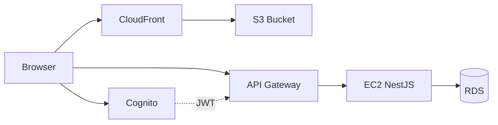

# ReVogue AWS Architecture

All components are defined in `terraform/` and wired via shared outputs.

## Component map

| Requirement | Implementation | Terraform file |
|-------------|----------------|------------------|
| **Amazon S3** | Frontend static assets (`out/`) | `frontend.tf` |
| **CloudFront** | CDN + HTTPS for S3 | `frontend.tf` |
| **API Gateway** | HTTP API → EC2 Elastic IP | `api-gateway.tf` |
| **Amazon EC2** | NestJS API (PM2) | `ec2.tf` |
| **Amazon RDS** | PostgreSQL 15 | `main.tf` |
| **IAM + VPC** | VPC/subnets, EC2 role, GitHub OIDC role, S3/CF policy | `vpc.tf`, `iam.tf`, `ec2.tf` |
| **Cognito** | User pool + app client (`custom:role`) | `cognito.tf` |
| **GitHub Actions** | CI + deploy workflows | `.github/workflows/` |

## Request flow



1. User loads app from **CloudFront** (static Next.js from **S3**).
2. User signs in via **Cognito** (Amplify on frontend).
3. Frontend calls **`NEXT_PUBLIC_API_URL`** = **API Gateway** URL.
4. API Gateway proxies to **EC2** (Elastic IP, port 3001).
5. NestJS verifies Cognito JWT, reads/writes **RDS**.

## Network (VPC)

- Default VPC (or `var.vpc_id`) — see `vpc.tf`, `main.tf`.
- **EC2** in public subnet with Elastic IP.
- **RDS** in private subnets; only EC2 security group on port 5432.
- **API Gateway** reaches EC2 over the public internet (HTTP proxy to EIP).

## CI/CD

| Job | Target | Auth |
|-----|--------|------|
| CI | Build + Terraform validate | — |
| deploy-backend | EC2 `/opt/revogue` | SSH key |
| deploy-frontend | S3 sync + CloudFront invalidation | IAM OIDC role |

## Key outputs

After `terraform apply`:

```bash
terraform output deployment_summary
terraform output github_secrets_checklist
terraform output frontend_env_snippet
terraform output backend_env_snippet
```

## Coordination checklist

- [ ] `github_repository` in `terraform.tfvars` matches your GitHub repo
- [ ] GitHub secrets populated from `github_secrets_checklist`
- [ ] `npm run db:migrate` run against RDS
- [ ] Cognito callbacks include CloudFront URL (automatic via Terraform)
- [ ] Frontend `.env.production` uses API Gateway URL, not raw EC2 IP
